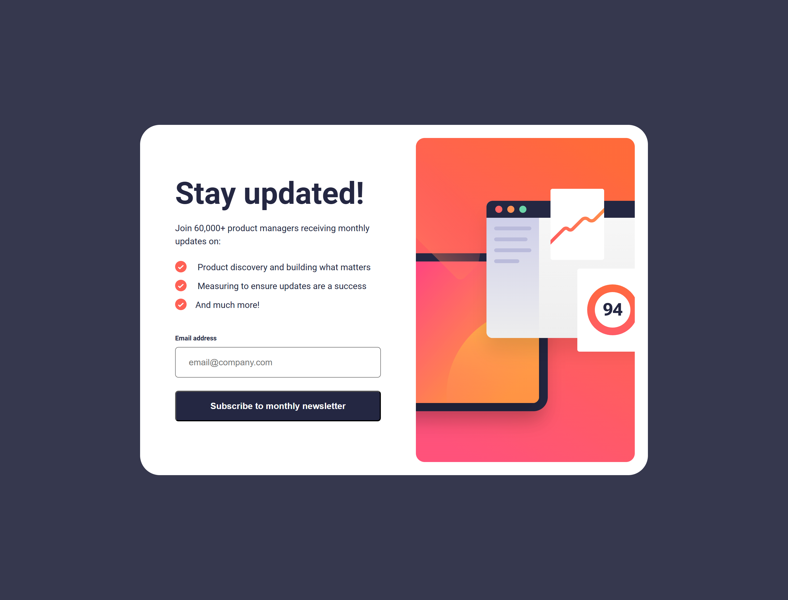
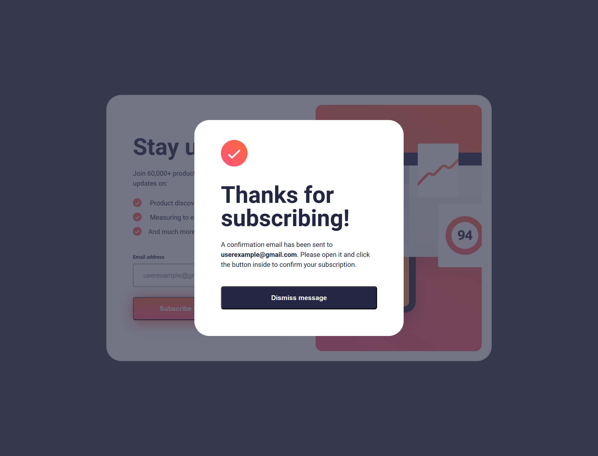

# Frontend Mentor - Newsletter sign-up form with success message solution

This is a solution to the [Newsletter sign-up form with success message challenge on Frontend Mentor](https://www.frontendmentor.io/challenges/newsletter-signup-form-with-success-message-3FC1AZbNrv). Frontend Mentor challenges help you improve your coding skills by building realistic projects. 

## Table of contents

- [Overview](#overview)
  - [The challenge](#the-challenge)
  - [Screenshot](#screenshot)
  - [Links](#links)
- [My process](#my-process)
  - [Built with](#built-with)
  - [What I learned](#what-i-learned)
  - [Continued development](#continued-development)
  - [Useful resources](#useful-resources)
- [Author](#author)

## Overview

### The challenge
The challenge is to build out a newsletter form, using any tools available, and get it looking as close to the original design as possible.

Users should be able to:

- Add their email and submit the form
- See a success message with their email after successfully submitting the form
- See form validation messages if:
  - The field is left empty
  - The email address is not formatted correctly
- View the optimal layout for the interface depending on their device's screen size
- See hover and focus states for all interactive elements on the page

### Screenshot

Desktop

Desktop with modal

For *mobile* and *mobile with modal* screenshots, check out the screenshot folder.

### Links

- Solution URL: [Add solution URL here](https://your-solution-url.com)
- Live Site URL: [Add live site URL here](https://your-live-site-url.com)

## My process

**Workflow:**

1. Set up folders and file structure
2. Determine strategy for structuring the page
3. HTML: set major structure with containers, placing the general content within them
4. HTML: starting from the top with each major container, assign content to individual elements and arrange them as necessary.
5. HTML: link and place <picture> and  / <source> files as necessary. Set media query sizes as necessary.
6. CSS: set up.
  - "Pencil in" the major structure using GPS: "reset & variables," "containers," "elements," "classes & ids," "media queries"
  - Write the CSS for the page reset in the ":root," <html>, <body>, and *. I generally put in the variable for colors, font, etc. at this time.
  - Set the media queries, adding in a change of background color so I can visually identify what query I am viewing and to have an element in the query as a placeholder
  - FIRST GIT COMMIT is generally done here
7. Starting from top to bottom in the HTML, set the CSS styles. In setting the styles, I generally organize the structure as follows:
  - structure => dimension
    - display
    - position
    - overall dimension
    - box properties (margin, padding, border)
  - background => foreground
    - background properties
    - typography
  - static => dynamic
    - transformation
    - animation
8. Style/add hover states and animation as necessary
9. Clean up code
10. Test functionality, responsiveness, and similitud with original model in Figma/style guide
11. Upload and publish

### Built with

- Semantic HTML5 markup
- CSS custom properties
- GPS CSS stylesheet organization
- Flexbox
- Mobile-first workflow
- JavaScript

### What I learned

While I didn't learn anything specifically new, I did have a good chance to practice some skills that had gotten rusty. I also struggled with the alignment of the bullet points in the unordered list on the mobile moble. I could not seem to sort out what was affecting the margin of the beginning of the paragraph just after the *before:* bullet point. The specing went awry after adding a `` element to the first two `<li>` elements. These were added to control the left margin of the final words of the paragraph to give the effect of it being a hanging indent.

### Continued development

The next phase in my development, apart from solving the issues I had in this particular project, is to develop more JavaScript and integrate it into the HTML and CSS to make my sites more interactive. 

With respect to CSS, again, I want to learn to make my pages more engaging to my users and so I tried to include a few animations that were not part of the challenge.

### Useful resources

- [GPS for CSS Organization](https://github.com/jescalan/gps) - This is the guide I have been using to organize my CSS. It is much more succinct than other methods, accommodates large projects and collaboration and is logically formed, and so logical to read.

## Author

- GitHub - [@jguleserian](https://github.com/jguleserian)
- Frontend Mentor - [@yourusername](https://www.frontendmentor.io/profile/jguleserian)
- LinkedIn - [@yourusername](https://www.linkedin.com/jeffguleserian)

# FMC-Newsletter-signup-with-success-message
